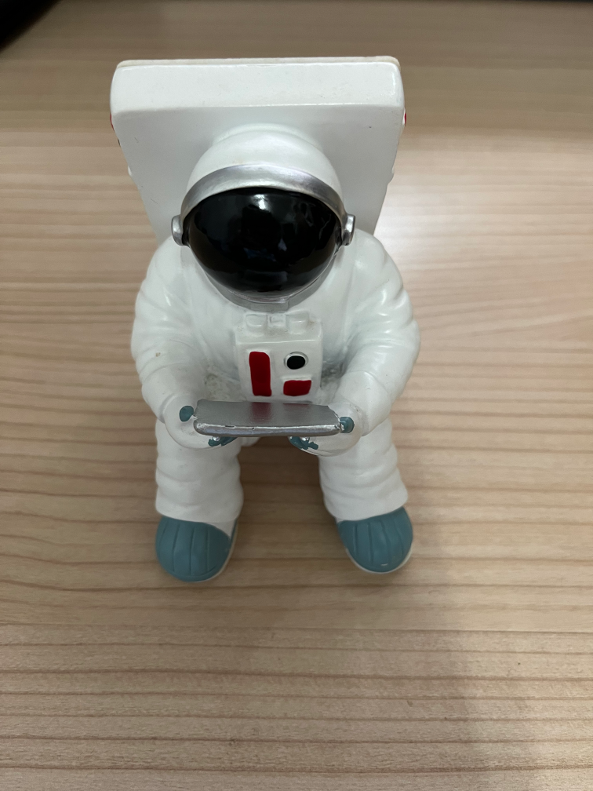
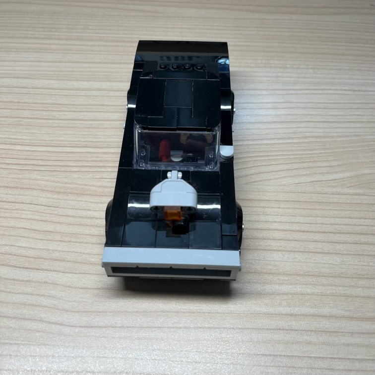
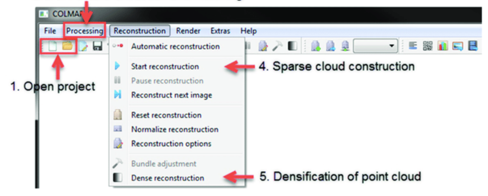

# NeRF-pytorch
神经网络和深度学习（DATA620004）期末作业，任务3：基于NeRF的物体重建和新视图合成.

## readme
我们尝试重建了两个不同的物件：

- 宇航员小摆件（9张照片）

</img>

以及

- 乐高小汽车（23张照片）

</img>

使用[COLMAP](https://github.com/colmap/colmap)提供的GUI软件进行自动进行（sparse以及dense）点云重建：



可以得到：
```
cameras.bin
images.bin
points3D.bin
```
这三个二进制文件。

然后使用`gen_poses.py`把点云数据转换成llff的格式。

数据转换、模型训练、模型测试的过程都写在脚本`main.sh`当中。

训练好的模型在`logs/astronaut/2000000.tar`和`logs/lego_car_dense/2000000.tar`。更多的训练日志见`logs/*`。

## 结果

最终渲染出了两个视频：

- 宇航员小摆件：效果很差，一方面可能是因为拍摄的过程中移动了物体。另外一方面可能睡因为训练数据很少。


- 乐高小汽车：效果还可以，吸取了上次的教训我们这次没有移动物体，并且加大了训练数据量。还选取了和桌子对比度更高的黑色小汽车。

